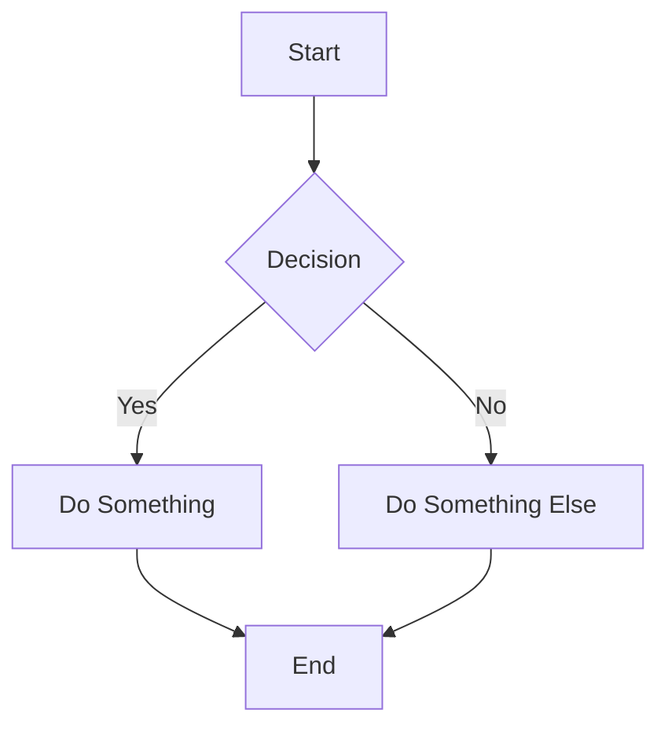

# Welcome to Ephemeral Markdown Viewer

A privacy-first markdown viewer that runs entirely in your browser. Nothing is saved after you leave.

## Features

- **Privacy First**: Your content stays in your browser
- **Advanced Rendering**: Code highlighting, math, diagrams
- **Navigation**: Table of contents, search, progress
- **Export**: Print, PDF, or copy HTML

## Code Example

```typescript
function greet(name: string): string {
  return `Hello, ${name}!`;
}

const message = greet("World");
console.log(message);
```

## Math Support

Inline math: $E = mc^2$

Block math:

$$
\int_{-\infty}^{\infty} e^{-x^2} dx = \sqrt{\pi}
$$

## Diagrams



## Tables

| Feature | Status |
|---------|--------|
| Markdown | ✓ |
| Code | ✓ |
| Math | ✓ |
| Diagrams | ✓ |

## Task Lists

- [x] Create viewer
- [x] Add math support
- [x] Add diagrams
- [ ] Add more features

## Blockquotes

> This is a blockquote. It can span multiple lines and include **formatting**.

## Links

Check out [GitHub Flavored Markdown](https://github.github.com/gfm/) for more info.

---

*Thank you for trying Ephemeral Markdown Viewer!*